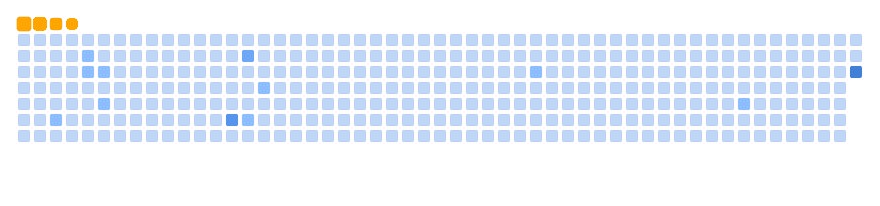

<h1 align="left" id="macropower-title">:wave: Hello there! I'm An Nguyen</h1>

  
  
  <!--  -->

I'm a Researcher at [University of Oxford](https://www.cs.ox.ac.uk/people/an.nguyen/)

- 🚀 &nbsp;My favorite topics are **Deep Reinforcement Learning**, **Robotics** and  other **Metacognitive Intelligence Systems**
- :computer: &nbsp;Learn more about my projects on my **[Page]**
- :book: &nbsp;Read more about my research on my **[Google Scholar]**
- :mailbox: &nbsp;You can reach me via **[LinkedIn]**

<!-- - :office: &nbsp;I'm currently open to collaboration opportunity **[]** -->
<!-- - :seedling: &nbsp;I’m currently working on my Ph.D. in Computer Science and Robotics **[homelab]** -->

<!-- - :mailbox: &nbsp;Ask me anything on my **[issues page]** -->
<!-- - :computer: &nbsp;Connect with me on **[LinkedIn]** -->

<h2 align="left" id="macropower-tech">Main Tech Stack</h2>

<!-- <table>
  <tr>
    <td align="center" width="96">
      
       Python
    </td>
    <td align="center" width="96">
      
       Pytorch
    </td>
    <td align="center" width="96">
      
       JavaScript
    </td>
    <td align="center" width="96"> 
      
       Docker
    </td>
  </tr>
</table> -->
<!-- links -->
[Page]: https://www.ducan.co.uk/ "My Page"

[Google Scholar]: https://scholar.google.com/citations?user=V_lzVjQAAAAJ&hl=en "My Scholar"

[LinkedIn]: https://www.linkedin.com/in/ducan-ng-andrew/

### ♟️ Want to connect in a fun way? 🏆

 Play a move in this [open-source chess game](https://github.com/anducnguyen/ReadMeChessTour) I built using GitHub workflows & Python. Let’s duel! 👇 

<!--  -->

This is an open chess match where anyone can join, which makes it all the more exciting! Inspired by [Kasparov vs. The World](https://en.wikipedia.org/wiki/Kasparov_versus_the_World)'s style. It's really fun to see if 2-or-more heads are better than 1!

It's your turn to play! Move a <!-- BEGIN TURN -->black<!-- END TURN --> piece.

<!-- BEGIN CHESS BOARD -->
|   | A | B | C | D | E | F | G | H |   |
|---|:-:|:-:|:-:|:-:|:-:|:-:|:-:|:-:|:-:|
| **8** |  |  |  |  |  |  |  |  | **8** |
| **7** |  |  |  |  |  |  |  |  | **7** |
| **6** |  |  |  |  |  |  |  |  | **6** |
| **5** |  |  |  |  |  |  |  |  | **5** |
| **4** |  |  |  |  |  |  |  |  | **4** |
| **3** |  |  |  |  |  |  |  |  | **3** |
| **2** |  |  |  |  |  |  |  |  | **2** |
| **1** |  |  |  |  |  |  |  |  | **1** |
|   | **A** | **B** | **C** | **D** | **E** | **F** | **G** | **H** |   |
<!-- END CHESS BOARD -->

**It's your turn to move! Choose one from the following table**
<!-- BEGIN MOVES LIST -->
|  FROM  | TO (Just click a link!) |
| :----: | :---------------------- |
| **A2** | [A1](https://github.com/milaabl/readme-chess/issues/new?body=Please+do+not+change+the+title.+Just+click+%22Submit+new+issue%22.+You+don%27t+need+to+do+anything+else+%3AD&title=Chess%3A+Move+A2+to+A1), [A3](https://github.com/milaabl/readme-chess/issues/new?body=Please+do+not+change+the+title.+Just+click+%22Submit+new+issue%22.+You+don%27t+need+to+do+anything+else+%3AD&title=Chess%3A+Move+A2+to+A3) |
| **B1** | [A3](https://github.com/milaabl/readme-chess/issues/new?body=Please+do+not+change+the+title.+Just+click+%22Submit+new+issue%22.+You+don%27t+need+to+do+anything+else+%3AD&title=Chess%3A+Move+B1+to+A3), [C3](https://github.com/milaabl/readme-chess/issues/new?body=Please+do+not+change+the+title.+Just+click+%22Submit+new+issue%22.+You+don%27t+need+to+do+anything+else+%3AD&title=Chess%3A+Move+B1+to+C3), [D2](https://github.com/milaabl/readme-chess/issues/new?body=Please+do+not+change+the+title.+Just+click+%22Submit+new+issue%22.+You+don%27t+need+to+do+anything+else+%3AD&title=Chess%3A+Move+B1+to+D2) |
| **B2** | [B3](https://github.com/milaabl/readme-chess/issues/new?body=Please+do+not+change+the+title.+Just+click+%22Submit+new+issue%22.+You+don%27t+need+to+do+anything+else+%3AD&title=Chess%3A+Move+B2+to+B3), [B4](https://github.com/milaabl/readme-chess/issues/new?body=Please+do+not+change+the+title.+Just+click+%22Submit+new+issue%22.+You+don%27t+need+to+do+anything+else+%3AD&title=Chess%3A+Move+B2+to+B4) |
| **C2** | [C3](https://github.com/milaabl/readme-chess/issues/new?body=Please+do+not+change+the+title.+Just+click+%22Submit+new+issue%22.+You+don%27t+need+to+do+anything+else+%3AD&title=Chess%3A+Move+C2+to+C3), [C4](https://github.com/milaabl/readme-chess/issues/new?body=Please+do+not+change+the+title.+Just+click+%22Submit+new+issue%22.+You+don%27t+need+to+do+anything+else+%3AD&title=Chess%3A+Move+C2+to+C4) |
| **D1** | [C1](https://github.com/milaabl/readme-chess/issues/new?body=Please+do+not+change+the+title.+Just+click+%22Submit+new+issue%22.+You+don%27t+need+to+do+anything+else+%3AD&title=Chess%3A+Move+D1+to+C1), [D2](https://github.com/milaabl/readme-chess/issues/new?body=Please+do+not+change+the+title.+Just+click+%22Submit+new+issue%22.+You+don%27t+need+to+do+anything+else+%3AD&title=Chess%3A+Move+D1+to+D2), [D3](https://github.com/milaabl/readme-chess/issues/new?body=Please+do+not+change+the+title.+Just+click+%22Submit+new+issue%22.+You+don%27t+need+to+do+anything+else+%3AD&title=Chess%3A+Move+D1+to+D3), [D4](https://github.com/milaabl/readme-chess/issues/new?body=Please+do+not+change+the+title.+Just+click+%22Submit+new+issue%22.+You+don%27t+need+to+do+anything+else+%3AD&title=Chess%3A+Move+D1+to+D4), [E2](https://github.com/milaabl/readme-chess/issues/new?body=Please+do+not+change+the+title.+Just+click+%22Submit+new+issue%22.+You+don%27t+need+to+do+anything+else+%3AD&title=Chess%3A+Move+D1+to+E2) |
| **E1** | [E2](https://github.com/milaabl/readme-chess/issues/new?body=Please+do+not+change+the+title.+Just+click+%22Submit+new+issue%22.+You+don%27t+need+to+do+anything+else+%3AD&title=Chess%3A+Move+E1+to+E2) |
| **F3** | [D2](https://github.com/milaabl/readme-chess/issues/new?body=Please+do+not+change+the+title.+Just+click+%22Submit+new+issue%22.+You+don%27t+need+to+do+anything+else+%3AD&title=Chess%3A+Move+F3+to+D2), [D4](https://github.com/milaabl/readme-chess/issues/new?body=Please+do+not+change+the+title.+Just+click+%22Submit+new+issue%22.+You+don%27t+need+to+do+anything+else+%3AD&title=Chess%3A+Move+F3+to+D4), [E5](https://github.com/milaabl/readme-chess/issues/new?body=Please+do+not+change+the+title.+Just+click+%22Submit+new+issue%22.+You+don%27t+need+to+do+anything+else+%3AD&title=Chess%3A+Move+F3+to+E5), [G1](https://github.com/milaabl/readme-chess/issues/new?body=Please+do+not+change+the+title.+Just+click+%22Submit+new+issue%22.+You+don%27t+need+to+do+anything+else+%3AD&title=Chess%3A+Move+F3+to+G1), [H2](https://github.com/milaabl/readme-chess/issues/new?body=Please+do+not+change+the+title.+Just+click+%22Submit+new+issue%22.+You+don%27t+need+to+do+anything+else+%3AD&title=Chess%3A+Move+F3+to+H2), [H4](https://github.com/milaabl/readme-chess/issues/new?body=Please+do+not+change+the+title.+Just+click+%22Submit+new+issue%22.+You+don%27t+need+to+do+anything+else+%3AD&title=Chess%3A+Move+F3+to+H4) |
| **H1** | [F1](https://github.com/milaabl/readme-chess/issues/new?body=Please+do+not+change+the+title.+Just+click+%22Submit+new+issue%22.+You+don%27t+need+to+do+anything+else+%3AD&title=Chess%3A+Move+H1+to+F1), [G1](https://github.com/milaabl/readme-chess/issues/new?body=Please+do+not+change+the+title.+Just+click+%22Submit+new+issue%22.+You+don%27t+need+to+do+anything+else+%3AD&title=Chess%3A+Move+H1+to+G1), [H2](https://github.com/milaabl/readme-chess/issues/new?body=Please+do+not+change+the+title.+Just+click+%22Submit+new+issue%22.+You+don%27t+need+to+do+anything+else+%3AD&title=Chess%3A+Move+H1+to+H2), [H3](https://github.com/milaabl/readme-chess/issues/new?body=Please+do+not+change+the+title.+Just+click+%22Submit+new+issue%22.+You+don%27t+need+to+do+anything+else+%3AD&title=Chess%3A+Move+H1+to+H3) |
<!-- END MOVES LIST -->

Having fun? Ask a friend to do the next move!

#### How it works

When you click on a link and submit a new issue with the desired move, a GitHub action is triggered, which in turn runs a small python script that performs the specified movement, updates this README file and commits the changes.

  
Last 5 moves in this game

<!-- BEGIN LAST MOVES -->

| Move | Author |
| :--: | :----- |
| `G4` to `H3` | [ @StackOverflowIsBetterThanAnyAI](https://github.com/StackOverflowIsBetterThanAnyAI) |
| `F1` to `H3` | [ @przemek890](https://github.com/przemek890) |
| `C8` to `G4` | [ @b8zhong](https://github.com/b8zhong) |
| `H2` to `H1` | [ @milaabl](https://github.com/milaabl) |
| `D7` to `D6` | [ @raphaeleze](https://github.com/raphaeleze) |

<!-- END LAST MOVES -->

  
Top 10 most moves across all games

<!-- BEGIN TOP MOVES -->

| Total moves |  User  |
| :---------: | :----- |
| 14 | [@przemek890](https://github.com/przemek890) |
| 8 | [@AzeemIdrisi](https://github.com/AzeemIdrisi) |
| 4 | [@b-hristov](https://github.com/b-hristov) |
| 3 | [@IGR2014](https://github.com/IGR2014) |
| 3 | [@zadif](https://github.com/zadif) |
| 2 | [@CloverGit](https://github.com/CloverGit) |
| 2 | [@abdbbdii](https://github.com/abdbbdii) |
| 2 | [@PanagiotisKots](https://github.com/PanagiotisKots) |
| 1 | [@kaisunoo](https://github.com/kaisunoo) |

<!-- END TOP MOVES -->

---